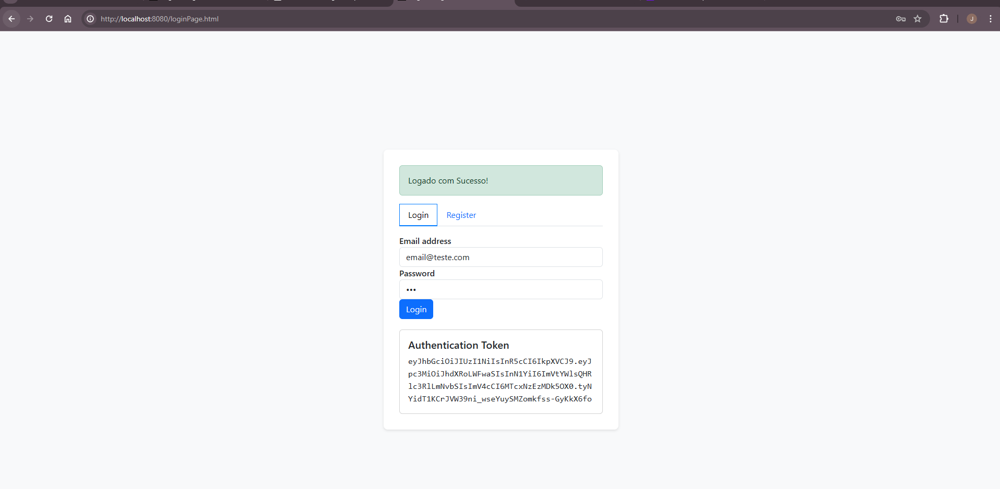

# BACKEND DE AUTENTICAÇÃO USANDO SPRING COM JWT E AUTENTICAÇÃO


Este projeto é uma API construída usando **Java, Spring, Migrações Flyway, PostgreSQL como banco de dados, e Spring Security e JWT para controle de autenticação.**

A API foi desenvolvida para meu uso pessoal, reaproveitando em projetos que venham a utlizar auth e jwt em spring.

## Índice

- [Instalação](#instalação)
- [Configuração](#configuração)
- [Uso](#uso)
- [Endpoints da API](#endpoints-da-api)
- [Autenticação](#autenticação)
- [Banco de Dados](#banco-de-dados)

## Instalação

1. Clone o repositório:

```bash
git clone https://github.com/joaovitormp1998/auth-api
```
2. Instale as dependências utilizando o Maven 

3. Instale o  [PostgresSQL](https://www.postgresql.org/)

## Uso

1. Inicie a aplicação utilizando o Maven.
2. A API estará acessível em http://localhost:8080


## Endpoints da API
A API fornece os seguintes endpoints:


POST /auth/register - Registra um novo usuário no aplicativo
### Exemplo de role "Admin"
```json
{
"email":"email@example.com",
"password":"senha",
"role":"ADMIN"
}
```

### Exemplo de role "Usuario"
```json
{
"email":"email@example.com",
"password":"senha",
"role":"USUARIO"
}
```


GET /product - Recupera uma lista de todos os produtos. (todos os usuários autenticados)

POST /product - Registra um novo produto (acesso de ADMIN necessário).

POST /auth/login - Login no aplicativo


```

## Autenticação

A API usa o Spring Security para o controle de autenticação. As seguintes funções estão disponíveis:

```
USER -> Função de usuário padrão para usuários logados.
ADMIN -> Função de administrador para parceiros gerentes (cadastrando novos parceiros).
```
Para acessar endpoints protegidos como um usuário ADMIN, forneça as credenciais de autenticação apropriadas no cabeçalho da solicitação.


## Banco de Dados

O projeto utiliza PostgresSQL como banco de dados. As migrações de banco de dados necessárias são gerenciadas usando o Flyway.


